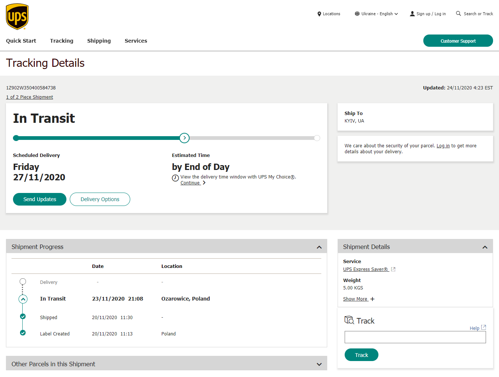

## Від задуму до початку реалізації

!> **Помилки немає:** отримання статусу переможця - 22 червня **2019** і наступний крок - початок тендерних процеду 25 вересня **2020** розділяють 1 рік і 3 місяці. Тобто замість того, щоб розпочати реалізацію проєкту, як належить, разом з початком 2020 року, команда майже 9 місяців примушувала велетенську бюрократичну махіну КМДА виправляти їхні ж тривіальні помилки і рухатись у накресленому планом напрямку.

## Закупівля і відправлення датчиків

**20 жовтня 2020** - Датчики закуплені, відправлені Постачальником через сервіс поштової доставки  UPS і вже на шляху до місця призначення:

