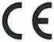
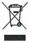
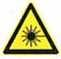

## Airly. Датчик забруднення повітря 

## Безпека використання

Датчик слід встановлювати відповідно до інструкцій, що додаються до пристрою, а використання елементів, що входять до комплекту, гарантує якість та надійність монтажу. Недотримання рекомендацій виробника може призвести до того, що пристрій відклеїться або від’єднається від місця встановлення.

Для своєї роботи датчик забруднення повітря потребує доступу до електричної мережі (230 В). Правильне підключення пристрою полягає у вставці USB-штекера пристрою в розетку USB джерела живлення (надається виробником), яке слід безпечно розмістити в електричній розетці (230 В), запобігаючи пошкодженню, затопленню або іскрам. Тільки використання оригінального джерела живлення (що постачається з монтажним набором) може гарантувати безвідмовну роботу пристрою. **Не використовуйте подовжувачі USB довжиною більше 2 метрів з діаметром дроту менше 0.51 мм.** Не використовуйте прилад під час грози, щоб уникнути ризику блискавки та пошкодження електричної системи. Рекомендований робочий діапазон пристрою: від -30 °C до 50 °C. Вплив на пристрій за межами рекомендованих значень може пошкодити його. Пристрій не можна піддавати падінню або іншим ситуаціям, які можуть його пошкодити.

Скарги не поширюються на пристрої, що були пошкоджені користувачем навмисно або ненавмисно або якщо користувач втручався в конструкцію пристрою (наприклад, видалення гарантійної печатки). У разі виявлення дефекту пристрою користувач повинен відключити пристрій від джерела живлення та зв’язатися зі службою технічної підтримки за адресою: serwis@airly.eu

## Декларація про відповідність нормам ЄС

Виробник *Airly Sp. z o.o.* заявляє, що пристрій *Airly-GSM-1 Sensor Pollution Sensor* відповідає відповідним положенням наступних директив:

- 2014/35/EC: Директива про низьку напругу (LVD);
- 2014/30/EC: Директива про електромагнітну сумісність (EMC);
- 2014/53/EU: Директива про радіо;
- 2011/65/EC: Директива про використання небезпечних речовин (RoHS).

## Утилізація

Європейська Директива 2012/19 / ЄС про відходи електричного та електронного обладнання (WEEE II) забороняє утилізацію старих побутових приладів як несортованих комунальних відходів. Використовуване обладнання необхідно збирати та сортувати окремо, щоб оптимізувати відновлення та переробку певних компонентів та матеріалів. Це зменшує забруднення навколишнього середовища та позитивно впливає на здоров’я людини. Перекреслений символ "смітник" на продукті нагадує споживачеві про особливі зобов'язання щодо сортування. Споживачі повинні зв'язатися зі своїми місцевими органами влади або продавцем для отримання інформації щодо поводження з їхніми відходами електричного та електронного обладнання.

## Потенційна загроза

Датчик використовує лазер для вимірювання забруднення повітря. Гарантуючи безпечне використання, ми хотіли б повідомити вас, що всередині пристрою використовується лазер, який може становити загрозу у випадку пошкодження обладнання.
