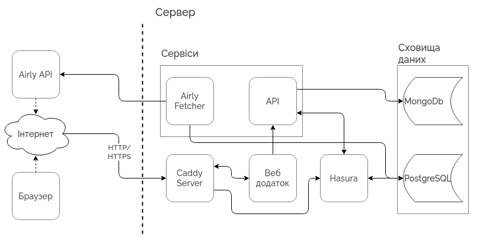

## Загальна блок-схема застосунку

Застосунок доступу до даних моніторингу включає три представлення:

- картографічний веб-застосунок виробництва Airly для перегляду останніх 48 годин спсостережень;
- картографічний мобільний застосунок виробництва Airly для перегляду останніх 48 годин спсостережень;
- застосунок представлення довготривалих рядів спостережень виробництва UEC.

На блок-схемі нижче представлений останній з трьох, а саме застосунок представлення довготривалих рядів спостережень виробництва UEC:

