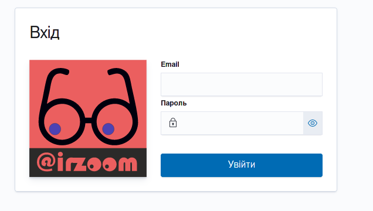

## Можливості інтерфейсу користувача

Користуватись застосунком може лише авторизований користувач, який, в залежності від ролі **користувач** / **менеджер**, має такі можливості:

|Можливості                          |Користувач|Менеджер|
|------------------------------------|----------|--------|
|Перегляд та експорт вимірювань      | +        | +      |
|Перегляд інформації по датчиках     | +        | +      |
|Перегляд сервісного журналу датчика | +        | +      |
|Додавання та видалення датчиків     | -        | +      |
|Ведення сервісного журналу          | -        | +      |
|Менеджмент організацій              | -        | +      |
|Менеджмент користувачів             | -        | +      |

## Авторизація

Здійснюється з допомогою логіну (email) та паролю.

Для успішного входу, логін та пароль користувача мають бути зареєстровані менеджером та передані користувачу. 

Користувач може змінити логін та пароль у власному кабінеті.
