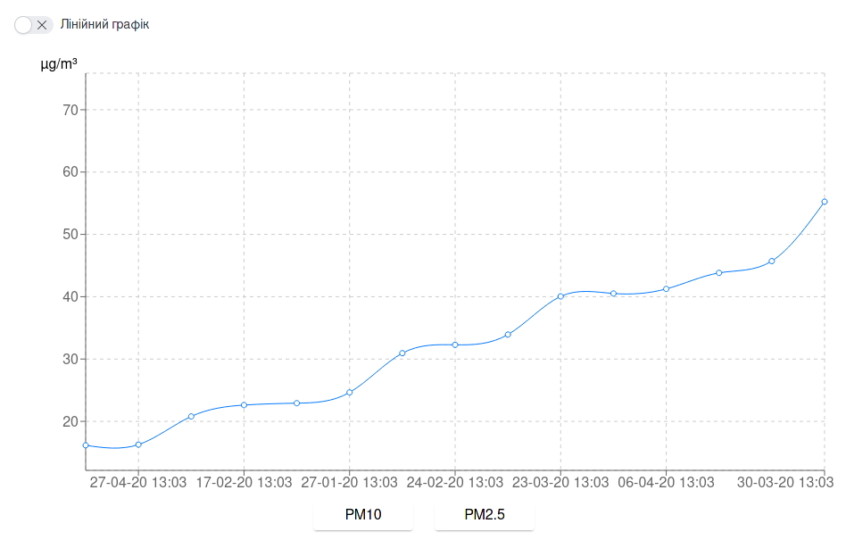

## Перегляд та експорт вимірювань

Щоб переглянути вимірювання за певний період потрібно ввести у відповідні поля:

 - рівень агрегації
 - початкову дату
 - кінцеву дату
 - ID датчика

Після чого написнути кнопку: "Отримати". Після процесу обробки даних на екрані з'явиться відповідна таблиця та графік. 

## Таблиця

Операції, що можна здійснювати над даними в таблиці, відповідають кнопкам у шапці таблиці і мають такі функції:

 - Експорт даних(у csv файл)
 - Фільтрація колонок
 - Сортування за колонками
 - Перехід в повноекраний режим

##  Графік

Дає можливість переглянути інформацію по кожному параметру окремо. Навігація здійснюється перемиканням кнопок під графіком.

